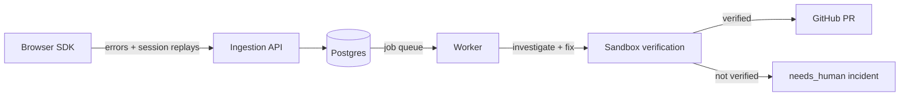

# Opslane

Opslane is an AI-powered production error-resolution engine for browser JavaScript apps. It ingests errors from your frontend, investigates the root cause, and either opens a fix pull request it has verified in a sandbox — or files an actionable incident that tells a human exactly what it found and why it stopped.

**Status: early stage.** Opslane currently supports browser JavaScript errors and GitHub repositories. APIs and schemas may change without notice. See [the launch documentation epic](https://github.com/opslane/opslane-oss/issues/2) for what's being built next.

## How it works



| Component | What it does | Where |
| --- | --- | --- |
| Browser SDK | Captures errors and session replays, with masking on by default | [`packages/sdk`](packages/sdk) |
| Ingestion API | Go service that receives events, groups errors, and serves the dashboard | [`packages/ingestion`](packages/ingestion) |
| Worker | Investigates errors with Claude, writes a fix, and verifies it in an [E2B](https://e2b.dev) sandbox before opening a PR | [`packages/worker`](packages/worker) |
| Dashboard | Vue app for incidents, replays, and project settings | [`packages/dashboard`](packages/dashboard) |
| CLI | Agent-friendly command-line access to incidents and projects | [`cli`](cli) |

Postgres is both the system of record and the job queue — there is no Redis or external queue to run.

Every investigation ends in an explicit state, one of three: a fix PR is opened only when the fix passed verification with high confidence (`pr_created`); a medium/low-confidence analysis is posted as `investigated`, with the root cause waiting for you to review and trigger a fix; and anything the worker cannot progress becomes a `needs_human` incident with a reason code, a plain-language explanation, and a suggested remediation.

## Run it locally

Prerequisites: Docker with Compose.

```bash
git clone https://github.com/opslane/opslane-oss.git
cd opslane-oss
docker compose up -d
curl http://localhost:8082/health
```

This starts Postgres, MinIO, the ingestion API (which serves the dashboard at <http://localhost:8082>), and the worker. Database migrations run automatically.

What you can do next depends on which credentials you provide:

1. **No credentials — smoke-test the pipeline.** Seed a test project and API key, then send an error event:

   ```bash
   docker compose exec -T postgres psql -U opslane -d opslane < scripts/seed-e2e.sql
   curl -X POST http://localhost:8082/api/v1/events \
     -H 'Content-Type: application/json' -H 'X-API-Key: e2e-test-key-plaintext' \
     -d '{"timestamp":"2026-01-01T00:00:00Z","error":{"type":"ReferenceError","message":"demo is not defined","stack":"ReferenceError: demo is not defined\n  at app.js:1:1"},"breadcrumbs":[],"context":{"url":"https://example.com","user_agent":"smoke test"},"sdk_version":"0.0.1"}'
   ```

   The event is captured and grouped, the worker picks up the investigation, and — since it has no AI or GitHub credentials — the error group ends in a `needs_human` state with an explicit reason code and message.

2. **Dashboard sign-in** uses GitHub OAuth, which requires a GitHub App: set `GITHUB_APP_CLIENT_ID`, `GITHUB_APP_CLIENT_SECRET`, and `DASHBOARD_ORIGIN=http://localhost:8082` in your environment before `docker compose up`. (Without `DASHBOARD_ORIGIN`, the OAuth callback redirects to port 3000 — the dashboard dev-server default — where nothing is listening in the Compose setup.)

3. **Full error-to-PR** additionally needs `ANTHROPIC_API_KEY`, `E2B_API_KEY`, and GitHub credentials with access to a repository the worker may open pull requests against.

SDK installation and configuration are covered in the [install guide](docs/install.md). Replay capture privacy defaults are described in [replay privacy and masking](docs/guides/replay-privacy.md).

## Repository layout

```text
packages/
  ingestion/   Go API, database, migrations, grouping, masking
  worker/      Investigation and fix pipeline, PR creation
  dashboard/   Vue dashboard served by ingestion
  sdk/         Browser SDK and framework integrations
shared/        Shared TypeScript contracts
cli/           Opslane CLI
eval/          Evaluation runner and fixture apps
docs/          Documentation
```

## Licensing

| Code | License |
| --- | --- |
| Server, worker, dashboard, eval, and tests | [AGPL-3.0-only](LICENSE) |
| Browser SDK ([`packages/sdk`](packages/sdk/LICENSE)), CLI ([`cli`](cli/LICENSE)), shared types ([`shared`](shared/LICENSE)) | MIT |

In short: the code that runs in *your* application and toolchain is MIT; the code that runs the Opslane service is AGPL.

## Contributing

Bug reports and feature requests are welcome on the [issue tracker](https://github.com/opslane/opslane-oss/issues). For codebase conventions and verification requirements, see [AGENTS.md](AGENTS.md).
