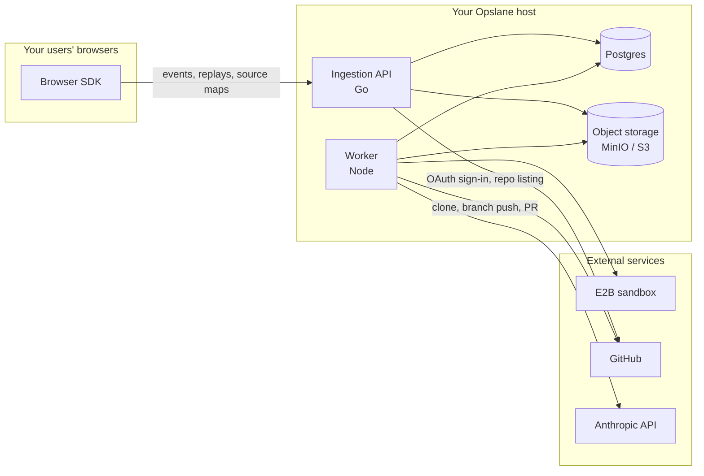

# Architecture overview

Opslane's runtime is four services plus two stores, with three distinct trust boundaries.

## Components

| Component | Runtime | Role |
| --- | --- | --- |
| **Browser SDK** (`packages/sdk`) | Your users' browsers | Captures errors, breadcrumbs, and default-on session recordings; masks in the browser before upload, with a server-side scrub gate before reads. MIT licensed — it runs in *your* product. |
| **Ingestion API** (`packages/ingestion`) | Go service | Receives events, groups errors by fingerprint (error type + message + stack), enqueues investigation jobs, serves the dashboard SPA, and exposes the read/write API. |
| **Worker** (`packages/worker`) | Node service | Claims jobs from Postgres, investigates with Claude, writes candidate fixes, verifies them in an E2B sandbox, and opens GitHub PRs. |
| **Dashboard** (`packages/dashboard`) | Vue SPA, served by ingestion | Incidents, replays, project and GitHub settings. |
| **Postgres** | Database | System of record **and** the job queue — jobs are claimed with `FOR UPDATE SKIP LOCKED` and lease-based ownership. There is no Redis or external queue. |
| **Object storage** | MinIO (local) or any S3-compatible store | Replay payloads and screenshots. |

## Trust boundaries

1. **Browser → ingestion.** Authenticated by per-environment API keys (stored hashed), origin-gated for browser endpoints, and rate-limited per project. Scrubbing starts in the browser (SDK) and continues server-side ([masking](trust.md#browser-data-and-masking)).
2. **Host → external services.** Two services cross this boundary, each only when credentialed. The **worker** reaches Anthropic (investigation), E2B (fix verification sandbox), and GitHub (clone, fix-branch push, PR). The **ingestion API** also reaches GitHub — OAuth code exchange and user/email lookup during dashboard sign-in, and installation/repository listing during GitHub App setup — so egress rules must allow GitHub from both services, not just the worker. With no credentials configured, nothing leaves your host and investigations end in explicit `needs_human` states.
3. **Worker → sandbox.** Candidate fixes execute in an isolated E2B sandbox, not on your Opslane host. Repository code is cloned into the sandbox; secrets in the worker's environment are scrubbed from what the agent can read (`repo-clone.ts`).

## Read next

- [Life of an error](life-of-an-error.md) — the pipeline stage by stage
- [Precision](precision.md) — what "verified" guarantees and what it does not
- [Trust](trust.md) — permissions, data flow, token handling, retention
