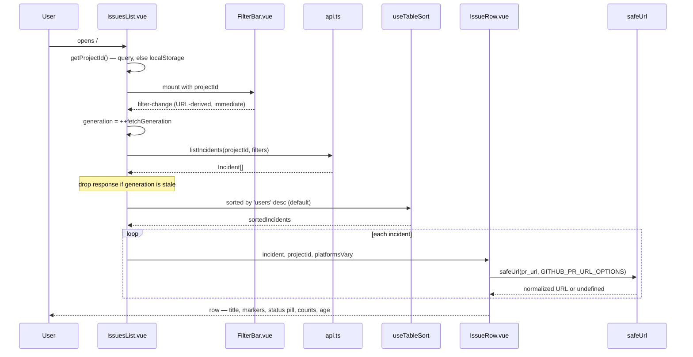

# Issue list: design and decision record

**Status:** Implemented, `c7b6e8b`..`8932d3f`
**Author:** Abhishek Ray
**Date:** 2026-07-22
**Branch:** `abhishekray07/issue-list`
**Implementation plan:** `docs/plans/2026-07-22-issue-list-polish.md` (v5)

This records why the issue list is shaped the way it is. The plan says what to build; this says what we rejected and why. Written for whoever opens this repo next, including me.

---

## 1. Problem

The select chevron renders on top of its own text.

`styles/base.css:85` sets `appearance: none` on every `<select>` and paints a chevron background image at `right 0.75rem center`. Nine selects across six files supply less right padding than that, so the arrow lands on the last character. Only `ui/SelectField.vue:42` reserves room (`pr-9`). The bug is visible in the first screenshot anyone takes of the product.

It is a small bug, and it is the honest reason this work started: the screen looked embarrassing. Looking closer turned up more.

Nothing in the product calls this screen the same thing twice. The file is `ActivityFeed.vue`, the route is `activity`, the nav says "Incidents", the sidebar subtitle says "Incident ledger", the page eyebrow says "INCIDENT LEDGER", the heading says "Production incidents", and the count says "1 record".

Every row carried a `KIND` cell with two stacked badges reading "Error" and "JavaScript". On a project where every issue is a JavaScript error, that is the same two words repeated down the page.

`IncidentLedgerRow.vue:29` rendered the fingerprint (`f37814ba355f3df260ec891e3e343433`) under each title. Nobody reads it.

The same relative timestamp appeared twice in every row, once in the meta line and once in the Last Seen column.

Two fields the API returns went unused. `first_seen` and `pr_url` are both on the `Incident` type (`types/api.ts:145,150`) and both rendered nowhere. `pr_url` is the product's entire value proposition: Opslane wrote you a fix. The list did not link to it.

Four review rounds later, the count of defects found in the *plan*, not the code, was 26.

---

## 2. Goals and non-goals

### Goals

- Make the list scannable in three seconds: what is worst, what is being worked on, what changed.
- Surface the fix. `pr_url` should be one click from the list.
- Fix the chevron bug everywhere it exists, not just where it was noticed.
- One noun for this concept across the whole product.

### Non-goals

These are deliberate, and each one is a decision rather than an omission.

| Not doing | Why |
|---|---|
| **Showing which file threw the error** | Needs a migration and a heuristic. It is the single highest-value improvement to this screen and it is deferred, not dismissed. Section 9.6 lays it out. |
| **Pagination, search, saved views** | The list is not long enough yet for any of them to earn their complexity. Revisit when a real project passes ~100 open issues. |
| **Replacing the 30-second poller** | It refetches the entire list to compare one integer (`ActivityFeed.vue:73-82`). Real waste, but it needs a Go endpoint, and this change is dashboard-only. Tracked in `TODOS.md`. |
| **Renaming the `Incident` type, `listIncidents()`, or `/api/v1/` paths** | The user-visible noun changes to "Issue". The backend keeps its name. Renaming both turns a reviewable diff into a sprawling one. |
| **GitHub Enterprise PR links** | The allowlist is `github.com` only. The dashboard cannot see the worker's `OPSLANE_GITHUB_URL` (`worker/src/repo-clone.ts:27`). Degrades to plain text rather than rendering an unsafe link. |

---

## 3. User requirements

Every requirement names how it is proven. A requirement without a proof is a wish.

| # | Requirement | Verified by |
|---|---|---|
| **R1** | No select chevron overlaps its option text, anywhere in the dashboard | `src/select-chevron-clearance.test.ts`: scans every `.vue` file for `<select>` without `pr-8`+. Currently fails with exactly 9 offenders |
| **R2** | A user can reach the fix from the list in one click | `incident-row.test.ts`: asserts `a[data-testid="pr-link"]` carries the `href`, `target="_blank"`, `rel="noopener"` |
| **R3** | A hostile `pr_url` never renders as a link | `__tests__/safe-url.test.ts`: 17 cases including `github.evil.com`, `github.com.evil.example`, `https://github.com@evil.example`, `javascript:` |
| **R4** | Hardening the sanitizer does not break existing links | Regression test: `safeUrl('http://langfuse.internal:3000/trace/abc')` still returns the URL. `LANGFUSE_BASE_URL` is operator-configurable (`docker-compose.yml:119`) |
| **R5** | An empty list explains the right reason | `activity-feed-filters.test.ts`: two cases: unfiltered shows the setup path, filtered shows "No issues match these filters" plus a reset |
| **R6** | Sorting works without a mouse | `activity-feed-filters.test.ts`: asserts 5 sortable headers, each containing `button[type=button]`, each `<th>` carrying `aria-sort` |
| **R7** | Header and row columns stay aligned at every viewport | Two layers: a jsdom class-matrix test compares `<th>` and `<td>` visibility classes element by element; `test-e2e/issue-list-columns.test.ts` asserts real visible counts at 640/1024/1280 |
| **R8** | An old `/incidents/:id` bookmark still resolves with its project scope | `src/router.test.ts`: imports the **production** `routes` array and asserts `/incidents/abc?project_id=proj-42` → `/issues/abc?project_id=proj-42` |
| **R9** | No user-visible string still says "incident" | Grep gate in the rename task: `grep -rni "incident ledger\|production incidents\|no incidents yet\|back to incidents"` returns nothing |
| **R10** | Age is readable in a narrow column | `format-compact-age.test.ts`: 9 cases including the 360-364 day boundary, clock skew, and unparseable input |

R7 is the only requirement whose proof spans two test layers, because jsdom does not apply media queries. It counts a `hidden lg:table-cell` cell as present. The class-matrix test catches drift between header and row; only a real browser catches whether the breakpoints are right.

---

## 4. System overview

Nothing new is introduced. The change is entirely within the existing Vue view, its row component, and one shared utility.



The stale-response guard deserves the callout. Change a filter twice quickly and two requests are in flight; only the newest generation may write state, so a slow first response cannot overwrite a fast second one. It is the subject of the existing test at `activity-feed-filters.test.ts:102`.

---

## 5. Component design

### 5.1 `safeUrl`: why there is only one

**What it does.** Validates any string before it is bound to an `href`.

**Why it is built this way.** The first draft of the plan added a new `safePrUrl` module. That was wrong: `utils.ts:34` already exported `safeUrl`, and it already guarded `pr_url` at four of its fifteen call sites. Two implementations of a security check is two policies, and the newer one being stricter does not make it the one people find.

The existing implementation was weak in three ways. It allowed any host. It allowed credentials in the authority. And it had zero tests despite guarding fifteen `href` bindings across nine files.

```ts
export interface SafeUrlOptions {
  httpsOnly?: boolean;          // default false — AdminView renders http trace_url
  hosts?: readonly string[];    // exact hostnames, lowercased
}

export const GITHUB_PR_URL_OPTIONS: SafeUrlOptions = {
  httpsOnly: true,
  hosts: ['github.com', 'www.github.com'],
};
```

Three properties carry the design:

Hosts are matched exactly. An earlier draft used `hostname.startsWith('github.')`. That accepts `github.evil.com` and `github.com.evil.example`. A suffix test (`endsWith('github.com')`) accepts `notgithub.com`. Neither is an origin check.

The permissive default stays permissive. Making `httpsOnly` the default would be a silent regression: `AdminView.vue:316` sanitizes `trace_url`, and `LANGFUSE_BASE_URL` defaults to https but is operator-configurable, so a self-hosted `http://langfuse.internal:3000` is legitimate. Every trace link would have stopped rendering with no error.

Normalization is opt-in. The draft returned `parsed.toString()` unconditionally. Five callers render the raw value as visible link text beside the href: `SessionDetail.vue:89`, `SessionsList.vue:197`, `IncidentDetail.vue:427`, and the two `install_url` sites. Normalizing centrally would make what a user reads differ from where the link goes. Strict mode normalizes; permissive mode returns the input byte for byte.

Two things about the default do change, and calling that "no change" would be false. Credentials are now rejected in every mode, and any caller passing options gets a normalized string.

The function is hardened once, so all fifteen inherit the credential rejection. Only the five `pr_url` sites are handed `GITHUB_PR_URL_OPTIONS` and become strict: `IncidentDetail.vue:406,422`, `AdminView.vue:324,325,331`, `IncidentConclusion.vue:20`, `SetupWizard.vue:361`, and the new row. The `trace_url`, `page_url`, and `install_url` sites keep the permissive default deliberately: they point at Langfuse, at customer pages, and at GitHub App install URLs respectively, none of which belong on a github.com allowlist. Asserting that each of those views actually calls the sanitizer is a separate pass, tracked in `TODOS.md`.

### 5.2 `IssueRow`: what earns a pixel

The old row carried a fingerprint hash, a duplicate timestamp, and a two-badge KIND cell. All three are gone. What survives is conditional:

```ts
// 'error' is the default kind and describes nearly every row.
const kind = computed(() =>
  props.incident.kind === 'error' ? null
    : kindBadge(props.incident.kind, props.incident.adjudication_status),
);
```

The platform marker is conditional on the *list* rather than the row. A row cannot know whether the others share its platform, so `IssuesList` computes `platformsVary` and passes it down. On a single-platform project the marker disappears entirely.

This is the rule the whole row follows: **only a deviation from the default earns ink.** A KIND column reading "Error / JavaScript" on every row is the same two words repeated down the page. A "Friction" marker on the one row that is friction is information.

The status pill signals its own clickability with shape:

```vue
<StatusLabel :tone="status.tone" :label="status.label">
  {{ status.label }}<span aria-hidden="true" class="ml-1">↗</span>
</StatusLabel>
```

Shape rather than colour, because the table is dense and colour alone fails for a colour-blind user. Without it, a "Draft PR" that opens GitHub and an "Analyzing" that does nothing are pixel-identical, and there is no hover on touch.

### 5.3 `useTableSort`: the inversion that caused a bug

The composable multiplies every comparator by the sort direction, and a newly-selected key defaults to `'desc'`:

```ts
const dir = sortDir.value === 'asc' ? 1 : -1;
return [...items.value].sort((a, b) => comparators[sortKey.value](a, b) * dir);
```

So the first click on a column renders your comparator negated. This produced a real bug: the age comparator's comment claimed "oldest-first is ascending age", which is backwards. The code happened to work; the comment would have misled the next person.

The fix is a diagram in the source rather than a longer sentence. Write comparators in their natural ascending sense and let the default invert them.

The default sort key changes from `last_seen` to `users`. That default was inherited, never chosen, and sorted by recency a single noisy one-off outranks an outage hitting three thousand people. The most prominent row on the screen was the least important one.

This one is an argument, not a measurement. There is no usage data behind it. No telemetry on which column people sort by, and not enough production installs to have any. If it turns out people open the list to answer "what just broke" rather than "what is worst", recency is the right default and this should flip. It is a one-line change to the `useTableSort` call and it has no migration behind it, so the cost of being wrong is a single commit.

### 5.4 Why the chevron fix is a class and not a stylesheet rule

The obvious fix is a padding rule in `@layer base`. It does not work: Tailwind v4 orders utilities in a later cascade layer than base, so any component's `px-2` wins. An unlayered rule *would* work, and was rejected for being invisible. A per-element class is greppable and testable, which is why R1 has a proof and a stylesheet rule would not.

Each select uses `pl-N pr-8` rather than `px-N pr-8`, avoiding the shorthand-versus-longhand question entirely.

---

## 6. Milestones

### M1: PR 1, what the user reads

Chevron fix across nine selects, `safeUrl` hardening, row and header rebuild, Age column, PR link, header and filter cleanup, both empty states, stacked mobile layout, and **every user-visible string on this screen**.

**Exit criteria:**
- `pnpm --filter @opslane/dashboard test` passes, and `select-chevron-clearance.test.ts` reports zero offenders
- `CAPTURE_DASHBOARD_SCREENSHOTS=1 pnpm --filter @opslane/test-e2e exec vitest run dashboard-screenshots.test.ts` reports **passing**, not skipped
- `grep -rni "incident ledger\|production incidents\|no incidents yet" packages/dashboard/src test-e2e` returns nothing

### M2: PR 2, what the code reads

Route name `activity` → `issues`, path `/incidents/:id` → `/issues/:id` with a redirect shim, file renames, and the four test files that hard-code the old route string.

**Gated on M1 merging.** M2 renames files M1 rewrites.

**Exit criteria:**
- `grep -rn "'activity'" packages/dashboard/src` returns nothing
- `pnpm --filter @opslane/dashboard build` passes, which is what catches stale imports
- `router.test.ts` proves the redirect preserves `?project_id`

The split line is whether a user sees it, rather than whether it counts as a rename. An earlier version put the `<h1>` in M1 and the empty state, error text, and nav label in M2. That would have merged a screen titled "Issues" whose empty state said "No incidents yet" and whose sidebar said "Incidents", visibly half-renamed on `main` for as long as M2 took.

**What `main` looks like between them.** Fully renamed to a user: heading, nav, empty states, error text, and the detail page's back link all say "Issues". The route is still `/incidents/:id` and the file is still `ActivityFeed.vue`. Nobody outside the repo can tell M2 has not landed, which is the point. M1 is shippable on its own and M2 can wait indefinitely without anything looking broken.

---

## 7. Testing and validation

Every unit test above runs in CI. Note that root `pnpm test` is `test:repo && test:unit`, and `test:unit` is `pnpm -r --filter '!@opslane/test-e2e' test`. The e2e package is excluded from the default gate.

The screenshot suite needs its own command, because two separate gates hide it. Beyond the package exclusion, `dashboard-screenshots.test.ts:17` is `describe.skipIf(!browserAvailable || !captureEnabled)`, so even running the package skips all 46 of its tests unless `CAPTURE_DASHBOARD_SCREENSHOTS=1` is set. Column alignment therefore lives in a separate non-capture file: a correctness check should not share a kill switch with screenshot generation.

The eight-point visual checklist in the plan needs a live run against a seeded stack. Migrations run through the Compose `migrate` service (`docker-compose.yml:140`).

One correction worth recording, because it invalidated a dozen verification steps: `pnpm --filter @opslane/dashboard test -- <file>` does **not** filter to that file. Measured: 46 files / 221 tests, versus 1 file / 4 tests for `pnpm --filter @opslane/dashboard exec vitest run <file>`.

---

## 8. Risks and mitigations

| Risk | Mitigation |
|---|---|
| A stale `{ name: 'activity' }` ships | `vue-tsc` cannot see route-name strings, because they are plain strings. The grep gate and `app-navigation.test.ts` are the real check |
| Header and row breakpoints drift, shearing columns | Class-matrix unit test plus real-width e2e assertions at three viewports |
| Hardening `safeUrl` breaks an existing link | Default left permissive; regression test pins the http trace case |
| Enterprise PR links stop rendering | Known and accepted. Degrades to plain text, never to an unsafe href |
| M1 grows past reviewable size | The design review roughly doubled its UI work. The stacked mobile layout is the clean split point if needed |
| The stacked mobile layout is the wrong call | It is additive: a `<div>` shown below `sm:` alongside a `<table>` shown at `sm:` and up. Reverting is deleting that block and restoring one breakpoint on the Users column. No data migration, no API change, no URL change. The e2e test would need its sub-640px assertion dropped with it |

**The risk with no mitigation:** the chevron test greps source text for `<select>` tags. A select built dynamically, or one rendered by a future component, passes it silently. No dynamic selects exist today and `SelectField.vue` is the sanctioned path for new ones, but nothing enforces that. A real fix is a lint rule or making `SelectField` the only way to render a select. Neither is in scope here.

---

## 9. Alternatives considered

### 9.1 Migrate the filters to `SelectField` (rejected)

`SelectField.vue:42` already solves the chevron problem correctly. Using it would remove the need for a policing test entirely.

Rejected because it renders a grid-layout `<label>` wrapper, so adopting it forces a filter-row relayout plus four unrelated restyles. That is scope growth on a bug fix. The DRY violation is real and recorded here rather than hidden.

### 9.2 Drop the Platform filter (rejected)

The first proposal deleted it as clutter. Investigation said no: `platform` is a URL query contract exercised by `activity-feed-filters.test.ts:73`, and the repo ships both a JavaScript and a Python SDK (`packages/ingestion/db/migrations/016_platform.sql`, `worker/src/harness/python-frames.ts`). The clutter came from the `Platform:` prefix label and the chevron bug rather than from the filter itself.

### 9.3 Delete the kind and platform markers entirely (rejected)

Variant C of the approved mockup has title-only rows, which is tighter. Rejected because `kind: 'friction'` is meaningful and `activity-feed-filters.test.ts:143` asserts it. Deleting the line would lose real information and break a test for the right reason. The conditional rule in 5.2 is the middle path.

### 9.4 Keep the two-column table on phones (rejected)

The v4 breakpoints left Title and Status below 640px. Nobody chose that; it fell out of hiding columns one breakpoint at a time. A two-column table is a list wearing a table costume, and the hidden columns are exactly the numbers that tell you which issue matters.

A middle option was available and cheaper: keep the table, but pull Users down to `sm:`. The stacked layout was chosen instead because the numbers deserve a shape that fits the viewport rather than a narrower version of the wrong one. It costs about a day, and it removed the column headers, which were the only sort control, which is why a mobile sort dropdown exists.

### 9.5 One empty state with neutral copy (rejected)

The cheaper fix for the filtered-empty bug was rewording the single state to something true in both cases. Rejected because a real first-time user then loses the onboarding push, and a filtered user still has no way back except resetting four dropdowns by hand. Two states, one with a "Clear filters" action.

### 9.6 Showing the culprit (deferred)

The single largest improvement to this screen is not in it. Sentry's rows are scannable because each carries a culprit: the file and function that threw. Ours carry an error title and nothing else.

**What exists.** `error_groups.sample_event_id` is populated on insert and update (`db/queries.go:585,591`) and already joined against `error_events` (`:1153`). `error_events.stack_trace_raw` is `NOT NULL` (`001_baseline.sql:66`). A V8 frame parser exists at `worker/src/source-map.ts:32`.

**What does not exist.** No culprit column on `error_groups`, and no field on the read API (`handler/read_api.go:30-50`).

One constraint is worth knowing before anyone starts. `parseStackFrames` returns `{ file, line, column }` only. Its regex matches `at functionName (file:line:col)` but the function-name group is non-capturing, so the name is matched and discarded. "Which function threw" is therefore not available today without changing that parser. A culprit would be `file:line`, not `function (file:line)`, unless the parser is extended first.

Roughly: a migration adding `culprit TEXT` to `error_groups`, populated at grouping time from the topmost in-app frame, skipping `node_modules`, vendor chunks, and framework internals. That heuristic is where the difficulty is: it is right most of the time and wrong in a way that is hard to detect, which is why it needs its own design rather than a paragraph here.

This is a proposal. Nothing in this section has a verified-by proof, unlike sections 3 through 8.

---

## 10. What this does not solve

The list still does not tell you *where* an error came from. Everything in this document makes the screen quieter and more honest about its states. A row still says `TypeError: Cannot destructure property 'name' of 'props.user.profile' as it is null` and leaves you to open it to find out which file that is. Removing the fingerprint hash removed noise; it did not add signal.

Someone triaging twenty issues will still open most of them. The culprit is what would fix that, and it is deferred.

---

## Appendix: decisions at a glance

| # | Decision | Beat |
|---|---|---|
| D1 | Harden the existing `safeUrl` with options | Adding a second validator |
| D2 | Permissive default preserved; strictness opt-in | https-only everywhere |
| D3 | Exact host allowlist | `startsWith('github.')` |
| D4 | Normalization opt-in | Unconditional normalization |
| D5 | Markers only when they deviate from default | Always show / never show |
| D6 | Default sort by users affected | Recency; actionable-first grouping |
| D7 | Two empty states | One neutral state |
| D8 | Status pill signals with an arrow glyph | Row chevron; whole-row link; nothing |
| D9 | Stacked rows below 640px | Two-column table; three-column table |
| D10 | Mobile sort dropdown | Silently dropping sort on phones |
| D11 | PR split on "does a user see it" | Split on "is it a rename"; one PR |
| D12 | Per-element padding class | Unlayered CSS rule; base-layer rule |
| D13 | Real `<button>` in each `<th>` plus `aria-sort` | `@click` on the `<th>` |
| D14 | Row and header rebuilt in one commit | Two commits, broken table between them |
