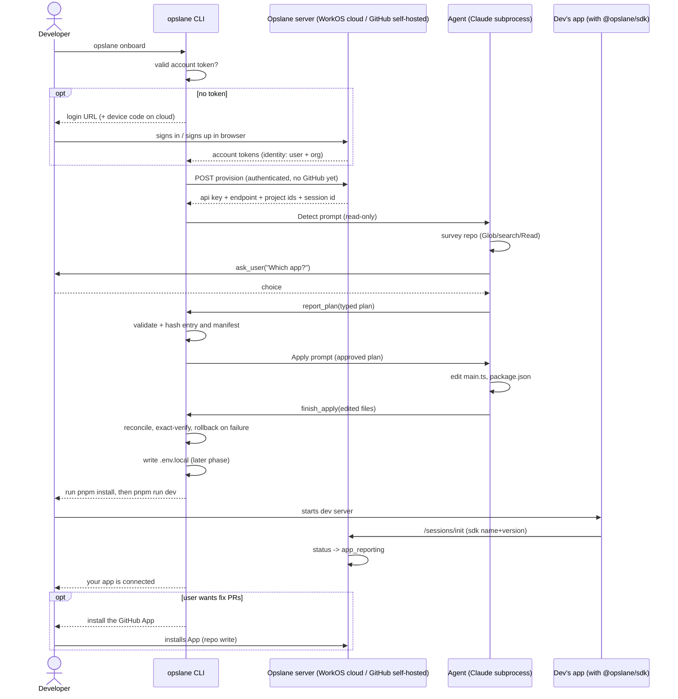

# Design: agent-guided onboarding (`opslane onboard`)

| | |
| --- | --- |
| Status | Reviewed — ready to implement |
| Author | Abhishek Ray |
| Date | 2026-07-22 |
| Prototype | branch `prototype/onboard-tui` — ran live against opslane-smoke, reached `app_reporting` |
| Plan of record | `docs/plans/2026-07-22-onboarding-10x-implementation.md` |
| Design origin | `docs/plans/2026-07-22-onboarding-10x-design.md` |

## 1. Problem

Every real user of the published SDK is stuck. `@opslane/sdk@1.0.0` never sends its name and version on `/sessions/init`, and the server only completes onboarding when it does (`session.go:195`). A user can wire everything correctly, watch events flow, and the status still reads `key_ok` forever. The fix is in source and unpublished.

The deeper problem is the manual install itself. In a clean Vite app it costs ten minutes of following docs. In a real repo (three frontends, a competitor's SDK already wired in, a custom `VITE_APP_*` prefix) the docs stop matching the code and people give up. A script can't handle that repo because a script only pattern-matches. An agent can read the repo and reason about it. That is the product bet, and the prototype confirmed the loop feels right.

## 2. Goals and non-goals

### Goals

- `opslane onboard` takes a developer from an uninstrumented repo to a confirmed connection (`app_reporting`) in one command.
- The agent edits code in the repo's own conventions (its env-var prefix, its config location), not ours.
- Every guardrail is pinned by a test: nothing mutates without permission, Apply has no Bash, no secret reads occur, and no edits can land after the agent reports done.
- Every run leaves a transcript on disk. The prototype's runs didn't, and we felt the gap.

### Non-goals (milestone A)

- The GitHub App and fix PRs (the whole repo-write half). A ends at the local aha; the GitHub App install is step 3 of the flow (§4) and belongs to a later milestone.
- The hard repo (milestone B). It starts the day A lands and it is the design's real acceptance bar. A passing A is not the design's acceptance; B is.
- Python and Flask (milestone C, gated on the Python SDK sending identity on `/sessions/init`).
- The production-setup PR (milestone E, gated on two open decisions).
- Users without an Anthropic API key. A runs on the developer's own key; a metered inference proxy is a GA gate.

### Milestone map

The letters below are one roadmap. This doc designs milestone A in full and defines the rest so their gates are legible.

| Milestone | What it is | Gate to start |
| --- | --- | --- |
| 0 | Publish the SDK identity fix (see §1) plus the Vite 8 peer range. Owner: whoever runs the changesets release; the next release is `≥1.2.0`. | none — do first |
| 0.5 | **Account-based provisioning (server).** Mint a project and key from an authenticated WorkOS (cloud) or GitHub-login (self-hosted) identity, with no GitHub App. This is the dependency that makes login-first onboarding possible (§4). | none — the login-first flow can't ship without it |
| A | This doc. Login-first `opslane onboard` end to end on a **clean single-app Vite repo**: authenticate, provision from the account, wire the SDK, reach `app_reporting`. No GitHub App in this milestone. | milestones 0 and 0.5 |
| B | The same flow on the **hard repo** (`asset-management-jira`: three frontends, an existing `@defender-dev/sdk` to migrate, a `VITE_APP_*` prefix). This is the design's 10/10 acceptance bar. | A lands |
| C | Python and Flask backends. | the Python SDK sends identity on `/sessions/init` |
| D | The warm GitHub App ask after the aha (step 3): install the App, open fix PRs. Plus a metered inference proxy so users don't supply a model key. | the P2 provider-agnostic callback launch gate (`docs/plans/2026-07-21-onboarding-p2-*`) |
| E | One production-setup PR: per-environment keys, source-map upload, release-SHA wiring. | two open decisions — who mints per-env keys, and how the agent gets git write |

Milestone A's own acceptance is the §7.3 smoke on a clean repo. The design's *product* acceptance is B. A green A proves the machine runs; it does not prove the product thesis, which is the hard repo.

The scope call worth naming: login-first A depends on milestone 0.5 (account provisioning), which does not exist yet. The prototype dodged this by using a pre-provisioned key and no login. Building 0.5 up front is what buys the correct flow order. The alternative, shipping A on the current GitHub-App-first path and reordering later, is faster to a demo but bakes in the wrong sequence. This design assumes we build 0.5.

## 3. User requirements

| # | Requirement | Verified by |
| --- | --- | --- |
| R0 | The user is a known, authenticated account before any repo access. `opslane onboard` runs login first if there's no valid token: cloud uses WorkOS, self-hosted uses the GitHub login path. | Login-gate test + provisioning tests |
| R1 | A developer in a clean Vite repo runs one command, answers one question, runs their dev server, and sees the terminal confirm the app connected. | Live smoke, §7.3 |
| R2 | The agent asks before editing. No run edits code without a human at a terminal. | Policy tests + non-TTY test |
| R3 | The model never touches key material. The CLI writes `.env.local`; the agent references variable names only. | Spec test + env-writer tests |
| R4 | The commands shown to the user come from the app's own `package.json` scripts, never from model text. | Report-validation tests |
| R5 | Ctrl-C or a crash mid-setup resumes on the next run instead of stranding the project. | Provisioning resume tests |
| R6 | Non-terminal callers get exactly one JSON object, zero ANSI bytes. | Piped-run check + contract tests |
| R7 | Every run is debuggable after the fact: full message transcript plus a cost summary on disk. | Run-log tests, §6 |

## 4. System overview

> **Updated 2026-07-23:** the agent is no longer one loop that investigates *and* edits. It is two stages — **Detect** (read-only, emits a typed plan) and **Apply** (executes an approved plan). The pipeline below is the current shape; §5.1–5.3 still describe the original combined loop and are superseded on that point. See `docs/plans/2026-07-22-phase-1-engine-core.md`.

```
  repo ──▶ ┌──────────────── DETECT (read-only) ────────────────┐
           │  tools: Read, Glob, search, ask_user, report_plan  │
           │  NO Edit / Write / Bash exist in this stage        │
           │                                                    │
           │   Read ──┐                                         │
           │   Glob ──┼──▶ reason ──▶ report_plan ──┐           │
           │   search ┘         ▲                   │           │
           │                    └── ask_user ◀──────┘ (ambiguous)│
           └────────────────────────┬───────────────────────────┘
                                    │
                     status='unsupported' ──▶ "no app to onboard" (terminal, not an error)
                                    │
                            status='ok' + typed OnboardingPlan
                            { app_dir, env_vars, dependency,
                              edit{ file, entry_hash,
                                    manifest_file, manifest_hash,
                                    init anchor/position/occurrence,
                                    import_line, init_block },
                              existing_sdk{ none|keep|migrate|no_op } }
                                    │
                                    ▼
                        ┌──── HUMAN APPROVAL ────┐
                        └────────────┬───────────┘
                                     ▼
           ┌──────────────── APPLY (edits) ─────────────────┐
           │  contain + re-hash entry and manifest          │
           │      ├── mismatch/unsafe ──▶ stop ──▶ re-Detect┼──┐
           │      └── current ──▶ snapshot both files       │  │
           │  agent edits exactly those two approved paths  │  │
           │  finish_apply(edited files)                    │  │
           │  reconcile settlement order + exact verify     │  │
           │      ├── failure ──▶ restore both snapshots ───┼──┤
           │      └── pass ──▶ report install required      │  │
           └────────────────────────────────────────────────┘  │
                                     ▲                          │
                                     └──────────────────────────┘
```

Three programs cooperate. The **CLI** runs on the developer's machine and owns everything deterministic: login, provisioning, key material, config files, status polling. The **agent** is a Claude Code subprocess spawned through `@anthropic-ai/claude-agent-sdk`; it owns the reasoning: survey the repo, ask, edit, report. The **server** is the existing Opslane ingestion service; it authenticates the user, mints the project and key, and flips the session status through `created -> provisioned -> key_ok -> app_reporting`. `key_ok` means the key works; `app_reporting` means the installed SDK phoned home from the running app.

### Identity first, repo access later

The flow separates two things onboarding used to conflate: *who you are* (identity, an account) and *access to your repo* (authorization, the GitHub App). Identity comes first; the GitHub App is deferred to the moment it's actually needed, which is opening PRs.

1. **Login/signup (identity), inline — not a separate command.** `opslane onboard` is the single entry point. If there's no valid token, *it* opens login or signup as its first step; the user never runs a separate `opslane login` first (that command stays only for re-auth). Two providers, selected by the server at boot via `AUTH_PROVIDER` (`handler/auth.go`): **cloud/default uses WorkOS**, **self-hosted (OSS) uses the GitHub login path**. It's a terminal flow: the CLI prints a URL (WorkOS also supports a device-code flow, `/authorize/device` + token poll, built for CLIs), the user signs in *or signs up* in the browser (WorkOS's hosted flow covers both — `supports_signup: true`), and tokens land in `~/.opslane/credentials.json`. Now the server knows the user and their org.

2. **Local setup (the aha), provisioned from the account.** With identity established, the server mints a project and key *for that account*, with no GitHub App and no repo write. The agent surveys, wires the SDK, the user runs the app, and the session reaches `app_reporting`. The local aha happens with zero access to the repo's history.

3. **GitHub App (authorization), after the aha.** Only when the user opts into fix PRs does onboarding ask for the GitHub App install. This is the warm ask, now placed after value instead of before it. On self-hosted, GitHub identity from step 1 may already cover this.

4. **PRs.** The App powers fix PRs and the prod-setup PR.



**The one piece this needs that doesn't exist yet — now scoped tightly.** The *identity* half is live-verified: a real WorkOS CLI login produced a JWT with `sub`+`org_id`, and `GET /api/v1/auth/me` returned the user, org, and `active_role: owner`, so `AuthenticateSession` accepting the CLI bearer is proven. What's actually new is only the **mint transaction** — a project and key created from that authenticated user and org — because today's only provisioning path (`POST /api/v1/agent/setup`) mints a key *after* the GitHub App install and derives identity from the GitHub account. Login-first onboarding provisions from the WorkOS/GitHub-login identity instead, composing existing helpers (`CreateProject`, `CreateAPIKeyTx`, `CreateAgentSession`) behind the confirmed middleware. See §8.

**Engine decision.** The engine is the Claude Agent SDK, as the prototype validated. An earlier license rejection of this dependency was reversed by founder decision on 2026-07-22: other shipping tools depend on it as a plain npm dependency, and we will not build our own harness. `docs/decisions/anthropic-agent-sdk-terms.md` carries the superseded note. `packages/agent-core` stays in the repo, unused.

## 5. Component design

### 5.1 The agent loop

> **Historical prototype context.** The transcript below is the original combined-loop spike. Production splits it into read-only Detect (`report_plan`) and narrow Apply (`finish_apply`). Apply has no Glob, search, or Bash and can write only the two hashed plan files.

`query()` spawns the bundled Claude Code binary as a child process and returns an async generator of messages. The loop runs on its own: the model emits text and tool calls, the harness runs the tools, the results go back to the model, repeat until it stops. We consume the stream; we do not drive the turns. A prototype run against `opslane-smoke` (a throwaway clean Vite + React app kept as the onboarding test target) read like this:

```
[tool] Glob {"pattern":"**/package.json"}
[tool] Read {"file_path":".../opslane-smoke/package.json"}
[tool] Glob {"pattern":"src/**/*.{ts,tsx}"}
[tool] Read {"file_path":".../opslane-smoke/src/main.tsx"}
[text] Found a single Vite + React app. Entry point is src/main.tsx...
[tool] mcp__onboard__ask_user {"question":"Instrument opslane-smoke?","options":["yes","no"]}
-- loop suspends here; the Ink select resolves the tool's Promise --
[tool] Edit {"file_path":".../src/main.tsx", ...}
[tool] mcp__onboard__finish_onboarding {"apps":[{"dir":".", ...}]}
[result] success
```

Two mechanics matter. A custom MCP tool's handler is an async function, so while its Promise is unresolved the whole loop waits. That is the entire human-in-the-loop mechanism: no polling, no IPC. And Ink owns the TTY, so the subprocess must never prompt; that constraint is why the guardrails live in tool config and `canUseTool` rather than in the subprocess.

### 5.2 The spec prompt: goal and constraints, not a recipe

The prototype's spec was ten imperative lines, and that was the wrong shape. It hardcoded the file (`src/main.tsx`), the env prefix (`VITE_OPSLANE_*`), and the Vite idiom — a codemod narrated to a model. It works on a clean single-app Vite repo and is wrong the moment the repo differs, which is the whole reason to use an agent instead of a codemod. The design's own D3 says follow the repo's convention, never impose one.

Production uses two specs. Detect is a goal-oriented, read-only investigation that chooses the app, entry, env convention, package manifest, and coexistence action, then calls `report_plan`. Host code contains both files, stamps both hashes, and pins the SDK version. Apply receives that approved typed plan: it may only weave the exact import/init/dependency into those two files, must not run installs, refuses migration, and ends with one `finish_apply`. PostHog's wizard remains the reference: a deterministic fence around a model judgment.

A live spike settled it. Against a repo using `VITE_APP_*` with config in `vite.config.ts`, the goal-based spec made the agent read the config, detect the prefix, and choose `VITE_APP_OPSLANE_API_KEY` — matching the repo. The recipe would have written `VITE_OPSLANE_API_KEY`, wrong there. It wrote no literal key, added the dependency, wired `init()` at the entry point, and flagged that it couldn't run the app.

One deterministic half, also from PostHog: the CLI runs a **survey pre-pass** — read `package.json`, the lockfile, the framework config, and `.env*` files to detect framework, entry point, env prefix, config location, and any existing SDK — and injects those findings into the prompt. The model gets a smaller, better-scoped job (wire it, given the map) rather than survey-and-reason-and-edit from a thin prompt. It still verifies and may correct the findings, but starts with a map. Each rule in the rendered prompt is pinned by a test, because the spec is the most-edited file in this system and a dropped line is invisible until an agent misbehaves.

### 5.3 Custom tools and the structured report

> **Superseded combined-report shape.** The interface below documents the prototype. Production Detect emits `OnboardingPlan`; Apply emits only canonical `edited_files` plus a summary. Install metadata is host-derived after exact verification.

The agent gets the SDK's file tools plus two custom MCP tools. `ask_user` pauses the loop and routes a question to the Ink UI; its resolver defaults to throwing, so a run with no UI attached fails fast instead of hanging. `finish_onboarding` is how the agent hands the CLI a machine-readable result:

```ts
interface OnboardingReport {
  apps: Array<{
    dir: string;              // app folder, relative to repo root
    apiKeyVar: string;        // e.g. VITE_OPSLANE_API_KEY — must match /^[A-Z][A-Z0-9_]*$/
    endpointVar: string;
    packageManager: 'npm' | 'pnpm' | 'yarn' | 'bun';
    devScript: string;        // must exist in that app's package.json scripts
  }>;
  editedFiles: string[];      // must reconcile with observed Edit/Write calls, both directions
}
```

The report is model output, so it is validated like input from a stranger: paths must resolve inside the repo root, var names must match the regex, `packageManager` is an enum, and `devScript` must exist in that app's `package.json`. The handoff line shown to the user is assembled only from these checked parts, so model free-text never becomes a command.

**When validation or reconciliation fails.** If the report is malformed, references a file the agent never edited, or the reverse (an edit with no report entry), the CLI writes no `.env.local`, does no polling, prints the run-log path and a one-line reason, and exits non-zero (`onboard_failed`). The provisioned session is *not* consumed, so the persisted pending state (R5) lets a plain re-run start a fresh agent against the same session, the same recovery path as a crash. A brand-new user's story is therefore "it stopped and told me to re-run," not a stranded project.

### 5.4 Tool policy: a gate, not a bypass

> **Production split.** Detect exposes read-only `Read`, `Glob`, and secret-aware search. Apply exposes only `Read`, `Edit`, `Write`, and `finish_apply`; its hook restricts mutations to the exact entry/manifest paths, and Bash is absent. The prototype policy below explains the permission findings that led to the two-layer hook plus fail-closed approval design, but its combined tool list is not the shipping configuration.

The prototype ran `permissionMode: 'bypassPermissions'` because Ink owns the TTY and the subprocess cannot prompt. Reading the actual SDK type definitions (`sdk.d.ts`, v0.3.217) surfaced two problems with carrying that into production. That mode bypasses all permission checks and is grouped with `auto` as an auto-allow mode, so `canUseTool` is never consulted, which would make the guardrails below dead code. And we do not want a bypass. Nothing should run without permission.

So the agent runs under `permissionMode: 'default'`. The SDK consults `canUseTool` only for tools **not** in `allowedTools`, which is the trap: a guard on a tool that sits in `allowedTools` is dead code. So nothing security-relevant is auto-run, and one composed handler holds the guard, the approval, and the finish-state together. Built-in `Read`/`Grep` are off, because a repo-wide `Grep` returns lines from a committed `.env.production` and can't be scoped away from it; the agent reads through secret-aware custom tools that refuse any `.env*` path.

```ts
allowedTools: ['mcp__onboard__ask_user'],             // the only tool with no guard
tools:        ['Glob','Write','Edit','Bash',
               ...customSurveyTools],                  // read_file / search / list_dir (secret-aware)
disallowedTools: ['Read','Grep','WebFetch','WebSearch'],  // built-in read/search + network OFF
permissionMode: 'default',                             // canUseTool consulted for all of the above

// ONE composed handler, injected by the controller (the approval seam):
createOnboardPolicy({ root, requestApproval }) => async (name, input) => {
  if (isDotenvPath(input.path ?? input.file_path)) return deny('never touch env files');
  if (name === 'Edit' || name === 'Write')
    return realpathInside(root, input.file_path)      // realpath: symlink-safe containment
      ? (await requestApproval(name, input) ? allow() : deny('user declined'))
      : deny('outside the repo');
  if (name === 'Bash')                                 // checks only — installs are the human's job
    return isCheckCommand(input.command)               // <pm> run build | tsc, NOT install
      ? (await requestApproval(name, input) ? allow() : deny('user declined'))
      : deny('only build or typecheck');
  if (state.finished && name !== 'mcp__onboard__ask_user') return deny('you already finished');
  if (name === 'mcp__onboard__finish_onboarding') state.finished = true;
  return allow();
}
```

The code above is the logic; it runs in two layers, because the spike proved `canUseTool` alone is shadowable. The hard denials (dotenv, out-of-repo writes, post-finish edits) run in a **PreToolUse hook** that can't be shadowed by `allowedTools` or a user's settings; `canUseTool` carries only the human approval and the one-finish state, and the subprocess runs with an isolated settings scope. So the dotenv denial actually runs and can't be bypassed, and post-finish edits are blocked. Installs are excluded from the Bash allowlist: `<pm> install` runs arbitrary `postinstall` code, and the spec already makes install the human's job, so letting the agent propose it was both a contradiction and the wrong risk to take.

Bash is allowed but checks-only, and behind approval. In onboarding the person clicking approve is a brand-new user with the least context and the most trust, the weakest reviewer of a disguised command. So two things guard it: the model can only ever propose a build or typecheck (a machine allowlist, no install, no free-form command), and the human still approves that. The payoff is limited but real: after the human installs, `tsc` lets the agent check its edits compile.

**What this does and does not stop, stated plainly.** Even a build script is the repo's own code, and `<pm> run dev` (which the human runs) is arbitrary code too. But onboarding a repo means running it: the user runs install and dev with or without us, so we aren't widening their exposure. The boundary we actually enforce is narrower and correct: the *agent* can't introduce a new execution path (no network, no install, no arbitrary command, no write outside the repo, no reading secrets), and can't run even a build without a human pressing yes. We don't defend a repo against its own owner; no onboarding tool can, because the owner already trusts it enough to develop in it. That assumption breaks only if we later run install on an unvetted repo (a cloud-side agent, milestone D+), where a sandbox becomes required. Flagged there, not solved here.

A live spike (2026-07-22, SDK 0.3.217) confirmed this: `canUseTool` fires for a tool absent from `allowedTools` and never fires under `bypassPermissions`. It also surfaced two things that harden the design. Entries in `allowedTools` *and* allow-rules in a user's settings file both silently shadow `canUseTool` (the SDK warns `CLAUDE_SDK_CAN_USE_TOOL_SHADOWED`), so the subprocess runs with an isolated settings scope and a no-shadow-warning tripwire. And the SDK recommends a PreToolUse hook as the un-shadowable way to gate every call, so the hard security denials (dotenv, out-of-repo writes, post-finish edits) live in a PreToolUse hook while `canUseTool` carries the human approval. Two layers, so a bug in one doesn't open the secret-read or escape path.

### 5.5 Navigation

The agent finds its way with three tools: `Glob` (filename patterns: `**/package.json` finds every app in a monorepo), `Grep` (content search: `loadEnv|envPrefix` finds a custom prefix, `@defender-dev/sdk` finds an existing install), and `Read`. This is the toolset Claude Code uses in any repo, minus the shell. The prototype needed four tool calls to locate the entry point in opslane-smoke.

This is enough for milestone A's clean repo, and the prototype proved it. Whether Glob and Grep survey scales to the hard repo (three frontends, a Forge backend running on Atlassian's hosted app runtime, and committed `.env.staging` per panel) is what milestone B tests. If discovery flails there, the candidate fix is a survey pre-pass the CLI computes and injects into the prompt, so the agent starts with a map instead of building one.

## 6. Observability

One constraint shapes this: the SDK spawns a subprocess, so we cannot instrument the model calls inside it. The message stream is the boundary we own, and everything below observes at that boundary.

**Run log: metadata by default, full transcript opt-in.** Every run writes `~/.opslane/logs/onboard-<sessionId>.jsonl` (mode 0600). By default it's **metadata only**: one line per message with timestamp, type, tool name, and a content hash and byte length, never the content or tool results, plus a summary line (outcome, turns, tool calls, duration, cost). That's the always-on, safe-to-share log the CLI points to on failure. A full transcript (message bodies, tool results) is an explicit `--debug-log` opt-in, because it can contain source and secrets: it runs field-level redaction over known-sensitive keys, is size-capped and retention-bounded, and prints a review-before-sharing warning. The earlier "always-on full transcript" was walked back after review flagged it as a new leak surface, especially paired with "attach this file."

**Traces, dev-only.** When `LANGFUSE_PUBLIC_KEY` and `SECRET_KEY` are set, emit one OTel span per turn and tool call, reusing the worker's pattern (`packages/worker/src/tracing.ts`). No-op without the keys, so it never activates on a user's machine.

**Funnel, already server-side.** The `agent_sessions.status` transitions (`created -> provisioned -> key_ok -> app_reporting`) with their timestamps are the drop-off funnel. Where users abandon is one SQL query.

## 7. Testing and validation

### 7.1 Unit tests (CI, no model, no TTY)

The line runs between deterministic code and the two files that wrap the live model and terminal. Everything deterministic is TDD'd with injected effects (`fetchFn`, `sleepFn`, a stub resolver), so no test needs a server, a model, or a TTY. The pins that matter: the exact tool policy (dotenv denial, Bash allowlist, one-finish lifecycle); adversarial report inputs (`../../etc`, `BAD=X\nY`, `curl|sh`, `dev; rm -rf /`) all rejected at the tool boundary; protocol edges (poll-token header, 404/429/transport mapping, resume-from-pending, timeouts naming the session id); and run-log redaction.

### 7.2 Refactor safety

Phases 2 and 3 refactor code that live commands depend on: setup's poll loop, init's env writer, the status contract. The pre-existing suites for those, including the contract-drift and subprocess tests, must stay green after each refactor. That is the proof, not review.

### 7.3 Live smoke (milestone A acceptance)

Pack the local SDK tarball and install it into a clean test repo. Run `opslane onboard` against the local stack, complete the browser step, answer the one question, run the printed handoff commands. The TUI must exit 0 on `app_reporting`, then confirm in Postgres by this run's session id:

```sql
select id, status from agent_sessions where id='<SID>';   -- expect: app_reporting
```

Query by session id, never project-wide, because a project-wide query can pass on a stale row. Also validated live: the piped run (`onboard < /dev/null | cat` emits one JSON line, zero ANSI bytes) and the packed-CLI install check.

`app_reporting` proves the app connected and identified itself, not that an error event was ingested. The smoke can optionally trigger a test error and check the events table.

## 8. Risks and mitigations

| Risk | Mitigation |
| --- | --- |
| Repo content prompt-injects the agent into hostile edits | No network tools; writes contained to the repo; report validated and reconciled against observed edits; human approves every edit and command; dotenv reads denied. The agent cannot introduce an execution path the user didn't already have (§5.4). |
| A malicious repo attacks its own owner via a postinstall or `dev` script | Out of scope, and correctly so: the user runs `install`/`dev` on their own repo regardless of us (§5.4). Changes if we ever run install on an unvetted repo (milestone D+ cloud agent), where a sandbox becomes required. |
| Crash mid-setup strands the user | The server answers a second `setup` POST for an already-provisioned repo with `already_configured` and mints nothing new. So the session id and poll token are persisted before the browser step, and a re-run resumes that pending session instead of POSTing again. |
| Model reports work it did not do | Report reconciled against observed Edit/Write calls, both directions, or the run fails with no env writes. |
| Agent ships edits that do not compile | Allowlisted `tsc`/build behind the approval gate lets the agent self-correct; a CLI-side typecheck after the report is the backstop. |
| License CI flags the Agent SDK's non-standard license string | Targeted allowlist entry citing the recorded 2026-07-22 reversal, not a general weakening of the checker. |
| Runaway agent cost or time | `maxTurns` cap; abort signal wired from the TUI; per-run cost in every run-log summary. |

Open, not solved:

- **The mint transaction for account provisioning is unbuilt (milestone 0.5).** The identity path is live-verified (WorkOS login → `/api/v1/auth/me` resolves user+org); what remains is minting the project+key from that identity, composing existing helpers behind the confirmed middleware. A build dependency, not a runtime risk, and now the smallest it can be.
- **The `default`-mode gate behavior is now verified** (spike, 2026-07-22): the gate fires, and the hardening (PreToolUse hook + isolated settings) is in the plan. No open runtime question remains here.

## 9. Alternatives considered

- **Ship A on the current GitHub-App-first provisioning, reorder to login-first later.** Faster to a demo, and it's what the prototype did (pre-provisioned key). Rejected as the plan of record: it bakes the wrong sequence into the first shipped flow and asks for repo write before the user has seen value, which is the exact friction the design exists to remove. We build milestone 0.5 instead.
- **In-repo harness (`packages/agent-core`)**: a provider-neutral tool loop built as a hedge during the license review. Rejected 2026-07-22 by founder decision: the Agent SDK is the validated engine and owning a harness is permanent cost for no product gain. It stays in the repo, unused.
- **Codemod instead of an agent**: rejected by the design itself. A codemod handles only the clean repo, and the clean repo is the case that does not need us.
- **Headless auto-answer for CI**: cut during review. Auto-selecting an app authorizes edits nobody approved, and the CLI's output contract requires a byte-clean JSON path for non-TTY callers instead.
- **Server-side (dashboard) agent**: rejected in the design. It cannot run the user's app locally, which kills the live confirmation moment the prototype proved out.

---

*Reviewed twice by an independent model (47 findings; 46 addressed, 1 overruled by founder decision). Plan of record: `docs/plans/2026-07-22-onboarding-10x-implementation.md`.*
